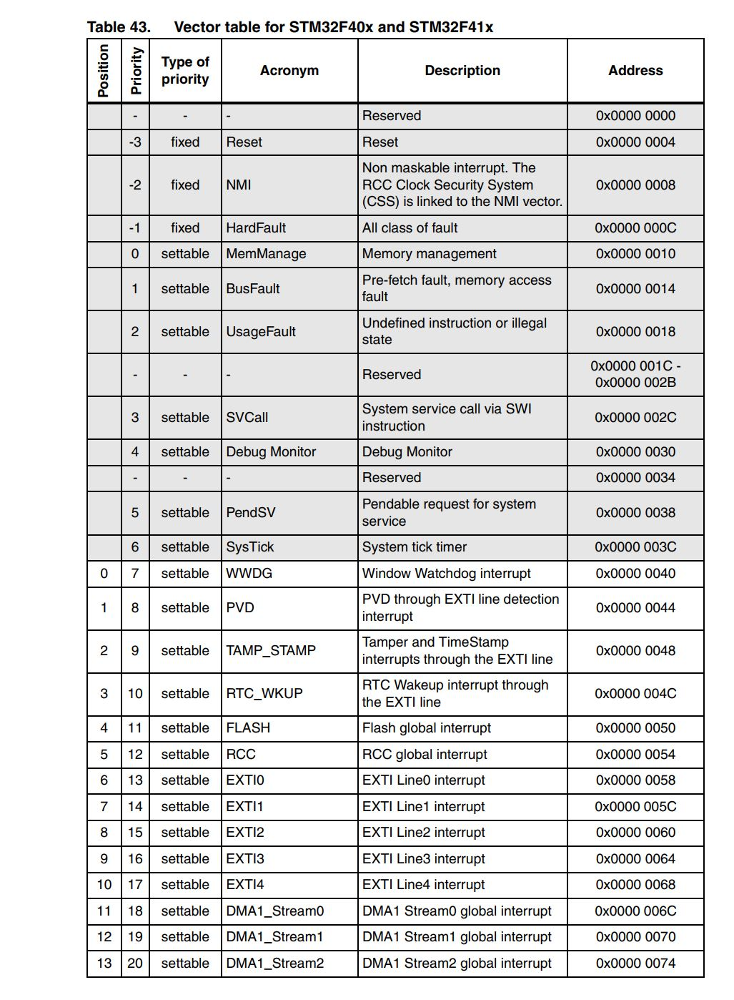

# STM32 Startup Test

## Contents

* [Overview](#Overview)
* [Installations](#Installations)
    * [STM32CubeMX](#STM32CubeMX)
    * [Build Tools](#Build-Tools)
    * [VSCode Editor](#VSCode-Editor)
* [ASM Modification](#ASM-Modification)
    * [Reset Handler](#Reset-Handler)
    * [Vector Table](#Vector-Table)
* [Credit](#Credit)

## Overview

A basic project is implemented to blink the <b>LD2</b> LED pin on the <b>STM32401RE</b> and communicate with the computer via <b>UART Serial Communication</b>. This involved sending a simple "Hello World" message to a serial <b>COM</b> port at the press of the <b>B1</b> User Button.

## Installations

### STM32CubeMX

The project files were generated using the <b>STM32CubeMX</b> Graphical Tool Software. The project configuration can be viewed and modified in the [(`StartupTest.ioc`)](StartupTest.ioc) file.

The <b>USART2</b> peripheral is configured in <b>Asynchronous Mode</b>. We selected the [Makefile](Makefile) toolchain to work with individually installed tools on the <b>VSCode</b> Editor.

### Build Tools

Flashing the project onto the <b>STM32 Nucleo Board</b> required the <b>ARM GCC</b> <b>C</b> Compiler, <b>Make</b> Automation Tool, and the <b>Open On-Chip Debugger (OpenOCD) Debugger</b> for Embedded Devices.

These tools were added to the <b>System Path</b> on the <b>Windows OS</b>.

### VSCode Editor

This project build and debug settings are specified in the [(`.vscode`)](.vscode) directory. The [(`launch.json`)](/.vscode/launch.json) and [(`c_cpp_properties.json`)](/.vscode/c_cpp_properties.json) were modified to integrate the debug functionality into <b>VSCode</b>.

The <b>Cortex-Debug</b> Extension made it easier to look at register contents during runtime.

Importing the <b>System View Description</b> from the [(`STM32F401.svd`)](STM32F401.svd) file in the launch settings gave the ability to view the peripheral register values during runtime as well.

## ASM Modification

The startup of the project was later optimized by translating the relevant functionality of the [(`startup_stm32f401xe.s`)](startup_stm32f401xe.s) <b>ASM</b> file in the [(`startup_stm32f401xe.c`)](startup_stm32f401xe.c) <b>C</b> file.

This required importing externally defined constants for memory addresses from the linker script [(`STM32F401RETx_FLASH.ld`)](STM32F401RETx_FLASH.ld).

```c
// Start Address For the Initialization Values of the .data Section.
extern uint32_t _sidata;
// Start Address For the .data Section.
extern uint32_t _sdata;
// End Address For the .data Section.
extern uint32_t _edata;
// Start Address For the .bss Section.
extern uint32_t _sbss;
// End Address for the .bss Section.
extern uint32_t _ebss;
// Top of Stack.
extern uint32_t _estack;
```

### Reset Handler

The ```void Reset_Handler();``` function is run when the program is flashed onto the <b>MCU</b>. This acts as the real entry point of our program before continuing onto our ```int main(void);``` function. .

This initializes the <i>data</i> (i.e.initialized data) and <i>bss</i> (i.e. uninitialized data) segments of the flash memory. We explicitly run the ```void SystemInit();``` function from the <b>ST Board Support Package</b> and ```void __libc_init_array();``` to initialize the static objects and run their constructors.

### Vector Table

We provide weak definitions for our <b>Hardware Interrupts</b> as function pointers as shown:

```c
__weak void NMI_Handler(void) { Default_Handler(); }
__weak void HardFault_Handler(void) { Default_Handler(); }
__weak void MemManage_Handler(void) { Default_Handler(); }
__weak void BusFault_Handler(void) { Default_Handler(); }
...
...
__weak void SPI4_IRQHandler(void) { Default_Handler(); }
```

The functions defined here will be overwritten if there are other functions with the same name.

We allocate the <b>Hardware Interrupts</b> as a vector in a section in flash memory. This tells the processor where to jump in flash memory with the following lines of code:

```c
__attribute__((section(".isr_vector")))
const void(*VectorTable[])(void) = { ... }
```

Based on the <b>STM32F40x Datasheet</b>, we fill in the vector table with the interrupt order specified in <b>Table 43. Vector table for STM32F40x and STM3241x</b>.

<p align="center">
    
</p>

<p align="center">
    -------------------------------------------
</p>

The reference to the <b>ASM</b> startup file was removed and the reference to the <b>C</b> startup file was added in the <b>Makefile</b>.


## Credit

This project was created and tested following tutorials from the <b><a href = "https://www.youtube.com/channel/UCuigr_BEzX1g3Qvwq5QjPXg">EmbeddedGeek</a> Youtube Channel</b>.
