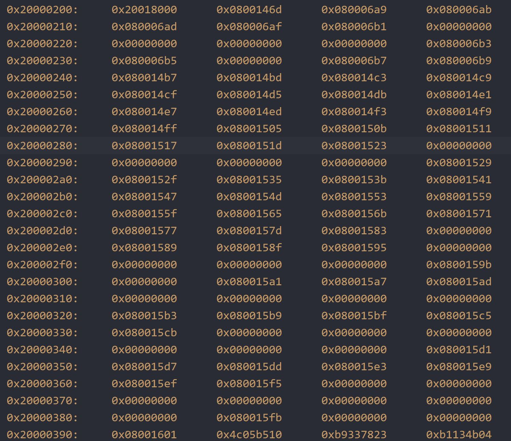

# STM32 and ARM Cortex-M4 Startup Test

## Contents

* [Overview](#Overview)
* [Installations](#Installations)
    * [STM32CubeMX](#STM32CubeMX)
    * [Build Tools](#Build-Tools)
    * [VSCode Editor](#VSCode-Editor)
* [Startup Modification](#Startup-Modification)
    * [Reset Handler](#Reset-Handler)
    * [Vector Table](#Vector-Table)
* [Memory Relocation](#Memory-Relocation)
    * [SRAM](#SRAM)
    * [SysTick Handler](#SysTick-Handler)
    * [Dynamic Relocation](#Dynamic-Relocation)
* [Flash Executable](#Flash-Executable)
    * [Serial Communication](#Serial-Communication)
    * [Demonstration](#Demonstration)
* [Credit](#Credit)

## Overview

A basic project is implemented to blink the <b>LD2 LED</b> pin on the <b>STM32401RE</b> and communicate with the computer via <b>UART Serial Communication</b>. This involved sending a simple "Hello World" message to a serial <b>COM</b> port at the press of the <b>B1</b> User Button.

<p align="center"></p>

The startup functionality was modified using the <b>Thumb Instruction Set</b> on the <b>ARM Cortex-M4 Core</b> processor. This was done by going into the <b>ASM</b> and modifying it into <b>C</b> code and by relocating the <b>Vector Table</b> from flash memory to static random-access memory (i.e. <b>SRAM</b>).

## Installations

### STM32CubeMX

The project files were generated using the <b>STM32CubeMX</b> Graphical Tool Software. The project configuration can be viewed and modified in the [(`Startup_Test.ioc`)](Startup_Test.ioc) file.

The <b>USART2</b> peripheral is configured in <b>Asynchronous Mode</b>. We selected the [Makefile](Makefile) toolchain to work with individually installed tools on the <b>VSCode</b> Editor.

### Build Tools

Flashing the project onto the <b>STM32 Nucleo Board</b> required the <b>ARM GCC</b> <b>C</b> Compiler, <b>Make</b> Automation Tool, and the <b>Open On-Chip Debugger (OpenOCD) Debugger</b> for Embedded Devices.

These tools were added to the <b>System Path</b> on the <b>Windows OS</b>.

### VSCode Editor

This project build and debug settings are specified in the [(`.vscode`)](.vscode) directory. The [(`launch.json`)](/.vscode/launch.json) and [(`c_cpp_properties.json`)](/.vscode/c_cpp_properties.json) were modified to integrate the debug functionality into <b>VSCode</b>.

The <b>Cortex-Debug</b> Extension made it easier to look at register contents during runtime.

Importing the <b>System View Description</b> from the [(`STM32F401.svd`)](STM32F401.svd) file in the launch settings gave the ability to view the peripheral register values during runtime as well.

## Startup Modification

The startup of the project was later optimized by translating the relevant functionality of the [(`startup_stm32f401xe.s`)](startup_stm32f401xe.s) <b>ASM</b> file in the [(`startup_stm32f401xe.c`)](startup_stm32f401xe.c) <b>C</b> file.

This required importing externally defined constants for memory addresses from the linker script [(`STM32F401RETx_FLASH.ld`)](STM32F401RETx_FLASH.ld).

```c
// Start Address For the Initialization Values of the .data Section.
extern uint32_t _sidata;
// Start Address For the .data Section.
extern uint32_t _sdata;
// End Address For the .data Section.
extern uint32_t _edata;
// Start Address For the .bss Section.
extern uint32_t _sbss;
// End Address for the .bss Section.
extern uint32_t _ebss;
// Top of Stack.
extern uint32_t _estack;
```

### Reset Handler

The ```void Reset_Handler();``` function is run when the program is flashed onto the <b>MCU</b>. This acts as the real entry point of our program before continuing onto our ```int main(void);``` function. .

This initializes the <i>data</i> (i.e.initialized data) and <i>bss</i> (i.e. uninitialized data) segments of the flash memory. We explicitly run the ```void SystemInit();``` function from the <b>ST Board Support Package</b> and ```void __libc_init_array();``` to initialize the static objects and run their constructors.

### Vector Table

We provide weak definitions for our <b>Hardware Interrupts</b> as function pointers as shown:

```c
__weak void NMI_Handler(void) { Default_Handler(); }
__weak void HardFault_Handler(void) { Default_Handler(); }
__weak void MemManage_Handler(void) { Default_Handler(); }
__weak void BusFault_Handler(void) { Default_Handler(); }
...
...
__weak void SPI4_IRQHandler(void) { Default_Handler(); }
```

The functions defined here will be overwritten if there are other functions with the same name.

We allocate the <b>Hardware Interrupts</b> as a vector in a section in flash memory. This tells the processor where to jump in flash memory with the following lines of code:

```c
__attribute__((section(".isr_vector")))
const void(*VectorTable[])(void) = { ... }
```

Based on the <b>STM32F40x Datasheet</b>, we fill in the <b>Vector Table</b> with the interrupt order specified in <b>Table 43. Vector Table for STM32F40x and STM3241x</b>.

<p align="center">
    
</p>


The reference to the <b>ASM</b> startup file was removed and the reference to the <b>C</b> startup file was added in the [(`Makefile`)](Makefile).


## Memory Relocation

The <b>Vector Table</b> was later relocated from flash memory to static random-access memory (i.e. <b>SRAM</b>).
This was done by modifying the <b>Vector Table Offset Register (i.e. VTOR)</b> in the [(`system_stm32f4xx.c`)](Src/system_stm32f4xx.c) source file.

We modify the <b>System Control Block (i.e. SCB)</b>, which provides system implementation information and system control. It can be accessed only from a privileged thread. This is done with the following line of code.

```c
SCB->VTOR = VECT_TAB_BASE_ADDRESS | VECT_TAB_OFFSET;
```

### SRAM

<b>SRAM</b> is volatile memory, which means that data is lost when the power is removed. Due to this, we copy the <b>Vector Table</b> from the flash memory to <b>SRAM</b>.

This allows dynamically changing <b>Exception Handler</b> entrance points during runtime. Also, if the flash memory is very slow, this allows for faster vector fetch.

For <b>ARM Cortex-M4 Core</b> processors, the <b>Vector Table</b> is of the format below, where <b>IRQ0</b> ... <b>IRQ239</b> are the starting addresses for <b>Device Specific Interrupt Service Routines (i.e. ISR)</b>.

<p align="center">
    
</p>

We use the <b>GDB Debug Console</b> to set breakpoints in the ```void SystemInit();``` function. We write the command ```x/256xw 0x08000000``` and view 256 <b>Words</b> of memory written at the starting address of the flash memory.

<p align="center">
    
</p>

We see that the <b>Vector Table</b> occupies memory addresses from `0x08000000` to `0x0800019C` in flash memory. This is equivalent to 412 <b>Bytes</b> occupied by 104 unique entries in the <b>Vector Table</b>. From this, we know to copy 104 <b>Words</b> of data in the ```void CopyVectTab(...);``` function.

Now, we use the <b>GDB Debug Console</b> to write the command ```x/104xw 0x20000200``` and view 104 <b>Words</b> of memory written at the offset address in <b>SRAM</b>.

<p align="center">
    
</p>

### SysTick Handler

The <b>Cortex-M4 Programming Manual</b> provided by <b>STMicroelectronics</b> states that <b>SysTick Exception</b> is generated when the 24-<b>Bit SysTick Timer (i.e. STK)</b> counts down from the reload value to 0. The <b>SysTick Timer (i.e. STK)</b> reloads this value on the subsequent clock edge and counts down again.

Let's use our <b>Debug Console</b> to see if the <b>SysTick Vector</b> holds the starting address of its <b>Exception Handler</b>. We first run the <b>GDB</b> command ```x/xw 0x2000023C``` to determine the intended starting address, ```0x80006B8```. Note that the starting address is stored in the <b>Vector Table</b> as ```0x80006B9``` to inform the processor that it's executing a <b>Thumb Instruction</b>.

Then we run command ```disassemble 0x80006B8``` to verify this is the starting address of the ```void SysTick_Handler(void);``` function as shown below.

<p align="center">
    
</p>

We see that the <b>Vector Table</b> copied to <b>SRAM</b> matches that in flash memory and that it maps the starting addresses of the <b>Exception Handlers</b>. From this, we assume we are successful at this stage.

### Dynamic Relocation

The <b>PendSV Exception Type</b> is a request for system-level service that's used for context switching between threads when other exceptions are inactive. As for the <b>SysTick Vector</b>, we determine the <b>PendSV Vector</b> to be located at address ```0x20000238```. From this, we determine the <b>PendSV Handler</b> starting address to be ```0x80006B6```.

While debugging, we can write the command ```set {int}0x2000023C = 0x80006B7```. This will instead store the starting address of the <b>PendSV Handler</b> at the <b>SysTick Vector</b>, with the <b>Least Significant Bit (i.e. LSB)</b> set to 1 to indicate the <b>Thumb Instruction</b>. By setting a breakpoint in the ```void PendSV_Handler(void);``` function, we can see this on the next system tick.

## Flash Executable

Flashing the (`Startup_Test.elf`) executable onto the <b>STM32 Nucleo Board</b> required modifying the [(`Makefile`)](Makefile) to include the `make flash` command.

```Makefile
#######################################
# flash
#######################################
flash: all
	openocd -f interface/stlink.cfg -f target/stm32f4x.cfg -c "program $(BUILD_DIR)/$(TARGET).elf verify reset exit"
```

### Serial Communication

The <b>PuTTY SSH</b> client is used to establish a terminal connection with the <b>STM32</b> device as shown below.

<p align="center"></p>

### Demonstration

The videos in the [`Demonstration`](Demonstration) directory show the <b>UART Communication</b> as well as the output on the <b>STM32 Nucleo Board</b>. I have embedded a low resolution compressed version below.

https://user-images.githubusercontent.com/52113009/130340062-9a8ce61d-4a7d-486b-936f-363cfbcd9d2f.mp4

## Credit

This project was created and tested following tutorials from the <b><a href="https://www.youtube.com/channel/UCuigr_BEzX1g3Qvwq5QjPXg">EmbeddedGeek</a> Youtube Channel</b> as well as the <b><a href="https://www.udemy.com/course/cortex-m/">Foundations of Embedded Systems with ARM Cortex and STM32</a> Udemy Course</b>.
